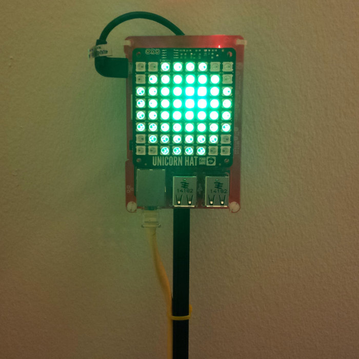

# Overview #
This project runs on a [Raspberry Pi](https://en.wikipedia.org/wiki/Raspberry_Pi) and polls a Jenkins API URI periodically, displaying the last build status for a software development team to monitor the [continuous integration](https://en.wikipedia.org/wiki/Continuous_integration) status. This practice is described here: [http://en.wikipedia.org/wiki/Build_light_indicator](http://en.wikipedia.org/wiki/Build_light_indicator).

It displays the build status using a [Pimoroni UnicornHat](http://shop.pimoroni.com/products/unicorn-hat). This makes it a plug-and-play solution, requiring minimal setup, to display the status of a Jenkins build.

If this sounds interesting, continue on to [Installation and Usage](docs/InstallationAndUsage.md)
